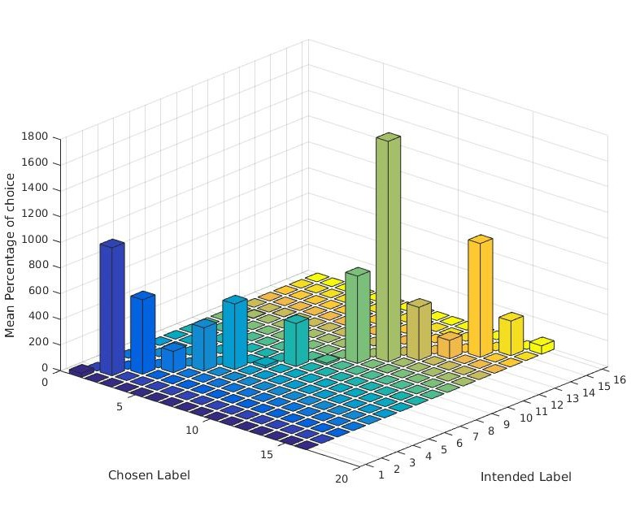
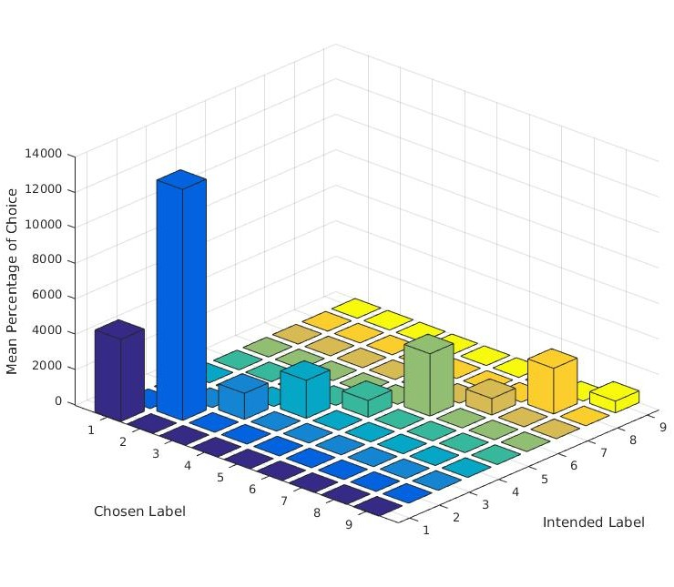
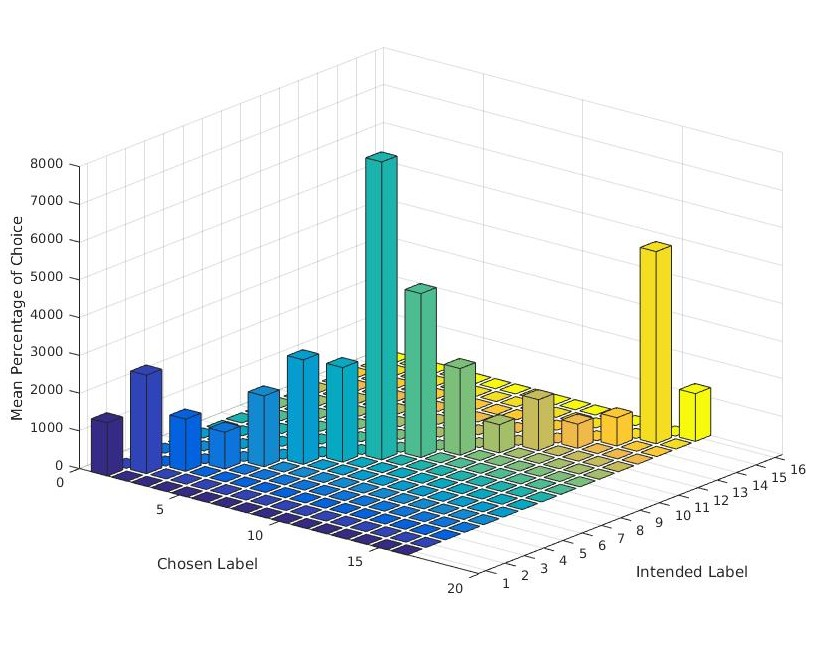
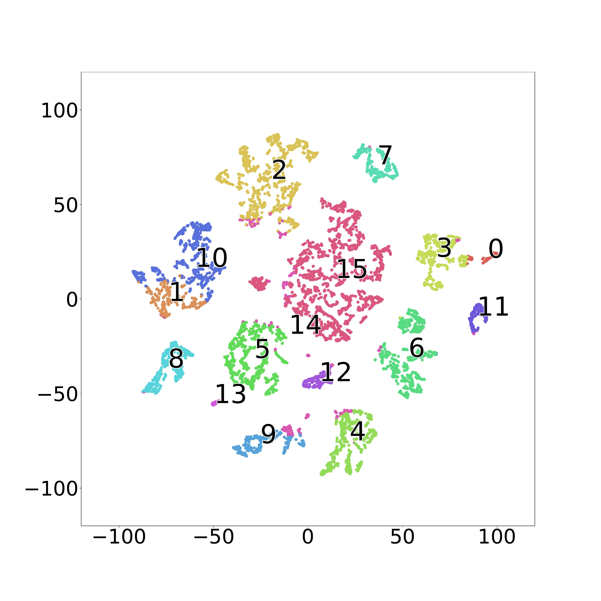
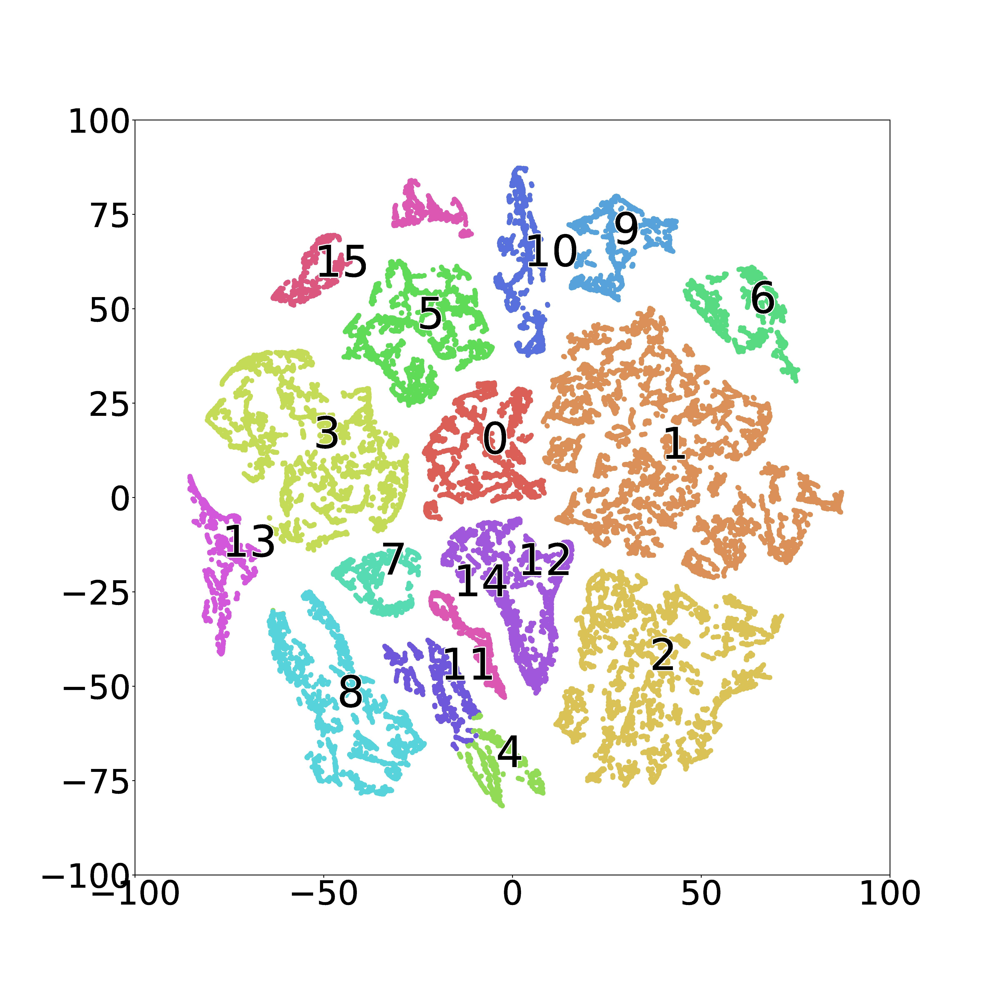

# Lightweight Spectral-Spatial Squeeze-and-Excitation Residual Bag-of-Features Learning for Hyperspectral Classification.

## Description

We designed an end-to-end spectral-spatial squeeze-and-excitation (SE) residual bag-of-feature learning (S3EResBoF) framework for HSI classification that takes input as raw 3D image cubes without engineering. Which can build a feature codebook representation by motivating feature maps that help classification and suppress feature maps that don't help based on the patterns of feature maps. To alleviates the classification performance and learn the joint spatial-spectral features every residual blocks connect to every other 3D convolutional layer through a identity mapping function followed by a SE block and which facilitates the backpropagation of gradients. Additionally we introduce batch normalization on every convolutional layer (ConvBN) to regularize the convergence of the network and bag-of-feature quatization for classification. The experiments are conducted using five well-known HSI data sets and compared with state-of-the-art classification methods, reveal that S3EResBoF provide competitive performance in terms of both classification and computation time.

## Model

Fig.1 The spectral-spatial squeeze-and-excitation residual Bag-of-feature (S3EResBoF) learning for HSI classification framework. The first step is sample extraction, where SxSxB sized sample is extracted from a neighborhood window  centered around the target pixel. Once samples are extracted  from  raw  HSI, they are put through the S3EResBoF to extract deep spectral-spatial features for calculate of classification scores.

## Prerequisites

- [Anaconda 2.7](https://www.anaconda.com/download/#linux)
- [Tensorflow 1.3](https://github.com/tensorflow/tensorflow/tree/r1.3)
- [Keras 2.0](https://github.com/fchollet/keras)

## Results

### Indian Pines (IP) dataset

   

Fig.2  The IP dataset classification result (Overall Accuracy 99.82%) using 20% samples for training. (a) False color image. (b) Ground truth labels. (c) Classification map. (d) Class legend. 

### University of Pavia (UP) dataset

   

Fig.3  The UP dataset classification result (Overall Accuracy 99.97%) using 20% samples for training. (a) False color image. (b) Ground truth labels. (c) Classification map. (d) Class legend.

### Salinas Scene (SS) dataset

   

Fig.4  The SA dataset classification result (Overall Accuracy 100%) using 20% samples for training. (a) False color image. (b) Ground truth labels. (c) Classification map. (d) Class legend.

### Confusion matrices
 

Fig.5  The confusion matrices for the datasets. (a) Indian Pines. (b) University of Pavia. (c) Salinas Scene. 

### t-SNE Visualizations
 

Fig.5  The t-SNE Visualizations for the datasets. (a) Indian Pines. (b) University of Pavia. (c) Salinas Scene.

## Citation

If you use this code in your research, we would appreciate a citation to the original [paper]:

    @article{roy2020lightweight,
     title={Lightweight Spectral-Spatial Squeeze-and-Excitation Residual Bag-of-Features Learning for Hyperspectral               Classification},
     author={Roy, Swalpa Kumar and Chatterjee, Subhrasankar and Bhattacharyya, Siddhartha and Chaudhuri, Bidyut B. and Platosˇ, Jan},
     journal={IEEE Transactions on Geoscience and Remote Sensing},
     year={2020}
     }
     
## Code Issues

<strong>  You are requested to Contact <a href="mailto:subhrasankar.chatterjee000@gmail.com" target="_blank" rel="noopener">Subhrasankar Chatterjee</a> for fix the issues .

## Acknowledgement

Part of this code is from a implementation of Classification of HSI using CNN by [Konstantinos Fokeas](https://github.com/KonstantinosF/Classification-of-Hyperspectral-Image) and [Gopal Krishna](https://github.com/gokriznastic/HybridSN).

## License

Copyright © 2019 Subhrasankar Chatterjee. Released under the MIT License. See [LICENSE](LICENSE) for details.
